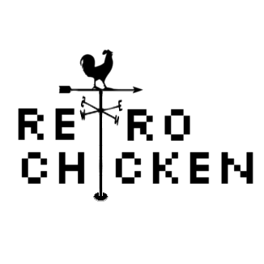

# Dungeon Crawler

This is a the repository for our turn and tile based dungeon crawler. The project is being made for Advanced Computer Science at LASA High School by Will Fisher, Zayan Vohra, Andy Mueller, Dodie Robison, and Nelson Barnes.



# Building
### Linux ###
For linux systems you can build and run the program by executing
```
$ cd <project-directory>
$ ./run-linux.sh
```
To solely build the program simply execute
```
$ cd <project-directory>
$ make -f makefile.mk linux-build
```
This will build the application to `<project-directory>/bin/linux/linux-build` which can be run using
```
$ export LD_LIBRARY_PATH="sfml/lib-linux" && bin/linux/linux-build
```
*Note: For linux systems SFML's dependencies must first be installed. The easiest way to do this is to install SFML from the package manager to auto-install dependencies. On Ubuntu this is* `sudo apt-get install libsfml-dev`*.*

### Windows ###
For windows systems you will need to install `MinGW` (32 bit) and make sure you have `g++` and `mingw32-make` installed. Upon doing this you can build and run the program by executing in cmd
```
$ cd <project-directory>
$ run-windows.bat
```
To solely build the program simply execute
```
$ cd <project-directory>
$ mingw32-make -f makefile.mk windows-build
```
This will build the application to `<project-directory>/bin/windows/windows-build` which can be run using
```
$ start bin/windows/windows-build
```

### OSX ###
To run the program on Mac OSX you will first need to install the SFML frameworks and dependencies. To do this go to the [SFML downloads](https://www.sfml-dev.org/download.php) page and install the Mac OSX binaries. To get the libraries extract that download and move the contents of `extlibs` and `Frameworks` into `/Library/Frameworks`. You can then build and run the program by executing
```
$ cd <project-directory>
$ ./run-mac.sh
```
To solely build the program simply execute
```
$ cd <project-directory>
$ make -f makefile.mk mac-build
```
This will build the application to `<project-directory>/bin/mac/mac-build` which can be run using
```
$ bin/mac/mac-build
```
